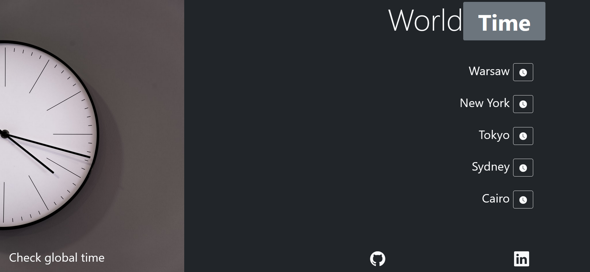

# WorldTimeWebsite

## Spis treści
* [Introduction](#Introduction)
* [Technologies and tools](#Technologies-and-tools)
* [Interface](#Interface)
* [Setup](#Setup)

## Introduction
WorldTime is a website which shows current time in 5 different cities and time zones. Using api from https://worldtimeapi.org/. Website contains 5 buttons - every button represents one continent and city:
1. Europe/Warsaw
2. America/NewYork
3. Asia/Tokyo
4. Australia/Sydney
5. Africa/Cairo

Current time is shown as an alert which closes after 3 seconds or can be closed manually by user.

## Technologies and tools

| ID | Name | Zastosowanie | Wersja |
| ------- | -------|------|------| 
| 1 | Visual Studio Code | Development Environment | - |
| 2 | Angular | App framework | 13.1.1 |
| 3 | Bootstrap | CSS framework | 5.1.3 |
| 4 | Bootstrap icons | Icons library  | 1.8.2 |
| 5 | SweetAlert2 | Custom alerts | 11.4.14  |
| 6 | HTML5 | Website structure |  7.24.0 |
| 7 | WorldTimeApi | API - to get current time from different time zones | 0.6.4 |
| 8 | Node.js | Engine |  14.17.4 |

## Interface

### Main page
 

### Current time alert
 
## Setup
```
npm install
ng serve

```
